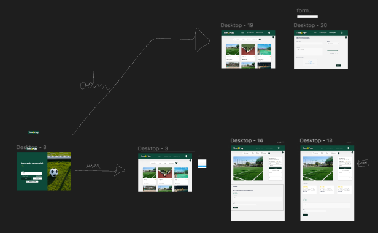
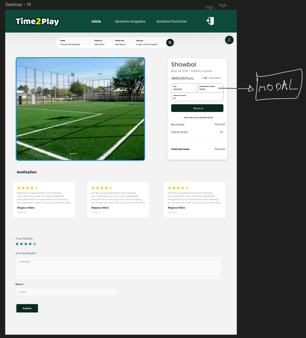

  

# Introdução

**Time2Play** é uma aplicação de aluguel de quadras esportivas que facilita o intermédio 
entre clientes que desejam praticar esportes e proprietários que desejam alugar suas quadras.

# Descrição do produto

O sistema permite que donos de quadras as disponibilizem para locação,
e que clientes possam alugá-las para uso. Time2Play gerencia a disponibilidade
das quadras e reservas, garantindo uma experiência completa e satisfatória para as partes.

### Prototipação do projeto

> Prototipação realizada com Figma.

### Estágio inicial de desenvolvimento

# Tecnologias

### Frontend

Desenvolvido em Typescript + React.

### Backend

Desenvolvido em Express.js (predição).

# Autoria

Projeto feito em 2024/2, por [Frederico Maia](https://github.com/fredmaia), [Otávio Sbampato](https://github.com/otaviosbampato/), e [Mateus Milani](https://github.com/milanimateus).
