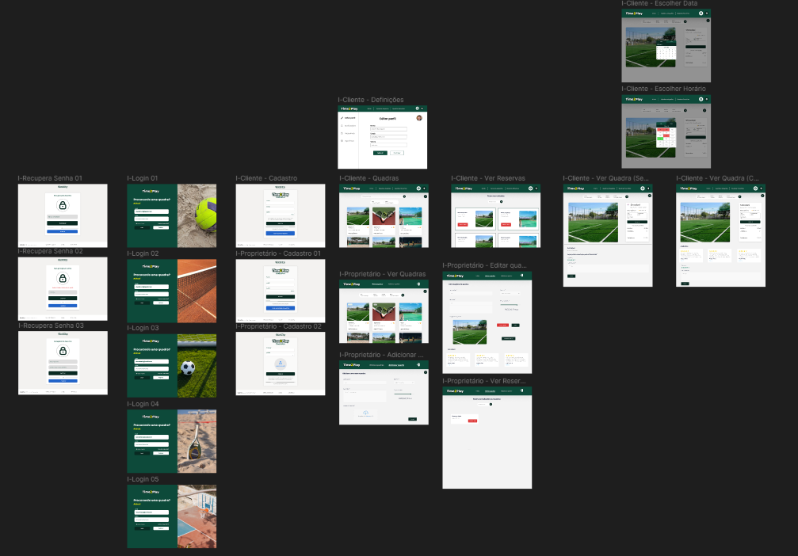

<div align="center">
  
</div>


# Introdução

**Time2Play** é uma aplicação de aluguel de quadras esportivas que facilita o intermédio entre clientes que desejam praticar esportes e proprietários que desejam alugar suas quadras.

# Descrição do produto

O sistema permite que donos de quadras as disponibilizem para locação, e que clientes possam alugá-las para uso. Time2Play gerencia a disponibilidade das quadras e reservas, garantindo uma experiência completa e satisfatória para as partes.

# Tecnologias

## Prototipação

* Desenvolvida com Figma, com navegação completa.





## Frontend

Desenvolvido em 
- Typescript (v5.6.2)
- React (v18.3.1).

### Estruturação de pastas

```
frontend/
│
├── uploads/
└── src/
    |── pages/
    ├── assets/
    └── shared
        ├──components
        ├──contexts
        └──utils
```

## Backend

Desenvolvido em 
- Express (v4.21.1)
- Prisma (v6.0.0)
- Typescript (v5.6.3)
- PostgreSQL (v17.2)

### Estruturação de pastas

```
backend/
│
├── uploads/
└── src/
    │
    ├── app/
    |   ├──controllers
    |   ├──middlewares
    |   └──schemas
    |── prisma/
    ├── database/
    └── modules/
        ├── Mail
        └── Cloudinary
```

### Comandos do prisma
```bash
npx prisma generate
npx prisma migrate dev
npx prisma studio
```

### Regras de git

- Regras de commit: Os commits devem ser feitos de forma a dizer, inicialmente, qual é o propósito do commit (feat, docs, fix, test...)
- Uso de branches: As branches são: develop e main. Após uma issue ser resolvida na develop, deve-se fazer o merge na main

# Como rodar o projeto

```
npm install
npm run dev
```

> [!CAUTION]
 > Esses comandos devem ser executados **2 vezes**, uma dentro do diretório "backend", e outra dentro do diretório "frontend".
 
# Autoria

Projeto feito em 2024/2, por [Frederico Maia](https://github.com/fredmaia), [Otávio Sbampato](https://github.com/otaviosbampato/), e [Mateus Milani](https://github.com/milanimateus).