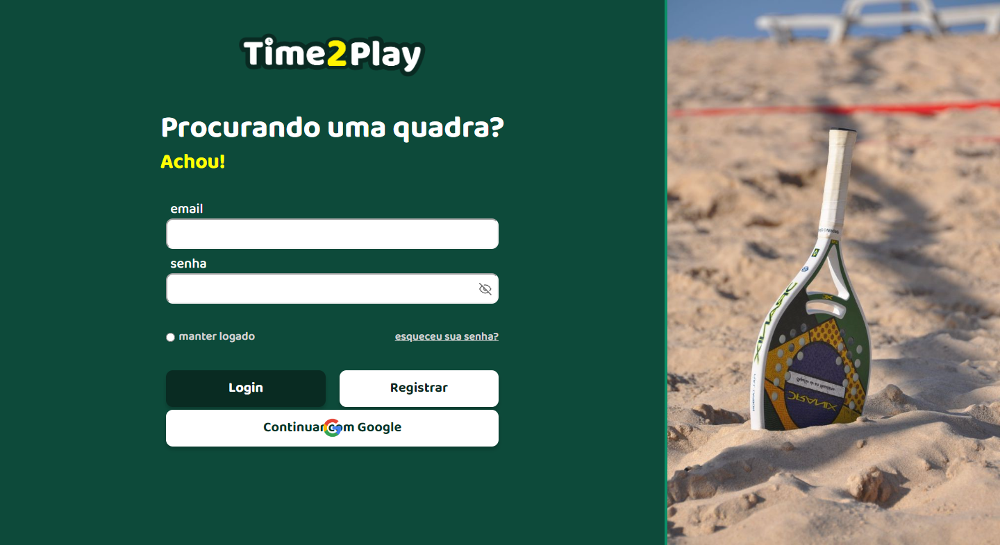

<div align="center">
  
</div>


# Introdução

**Time2Play** é uma aplicação de aluguel de quadras esportivas que facilita o intermédio 
entre clientes que desejam praticar esportes e proprietários que desejam alugar suas quadras.

# Descrição do produto

O sistema permite que donos de quadras as disponibilizem para locação,
e que clientes possam alugá-las para uso. Time2Play gerencia a disponibilidade
das quadras e reservas, garantindo uma experiência completa e satisfatória para as partes.

## Prototipação do projeto

### Figma.

## Estágio inicial de desenvolvimento



# Tecnologias

## Frontend

Desenvolvido em 
- Typescript (v5.6.2)
- React (v18.3.1).

### Como rodar o projeto
```
npm install
npm run dev
```

## Backend

Desenvolvido em 
- Express (v4.21.1)
- Prisma (v6.0.0)
- Typescript (v5.6.3)
- PostgreSQL (v17.2)

### Como rodar o projeto
```
npm install
npm run dev
```

### Comandos do prisma
```bash
npx prisma generate
npx prisma migrate dev
npx prisma studio
```

# Autoria

Projeto feito em 2024/2, por [Frederico Maia](https://github.com/fredmaia), [Otávio Sbampato](https://github.com/otaviosbampato/), e [Mateus Milani](https://github.com/milanimateus).
